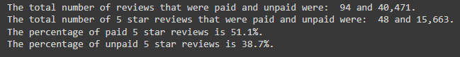
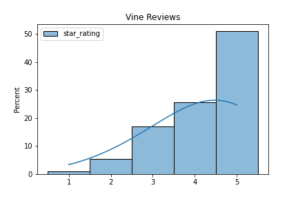
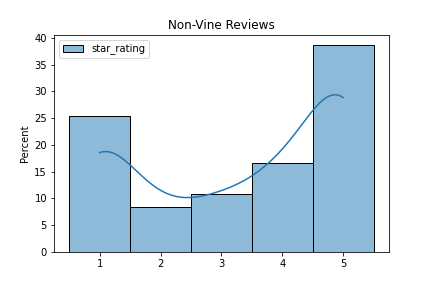

# amazon_vine_analysis

## Overview

Amazon has a program called Amazon Vine in which sellers of products can pay to have their products reviewed by Amazon Vine members.
The Amazon Vine program selects trusted reviewers based off of several criteria including feedback from other customers, review helpfulness, number of reviews, etc.
The objective of this analysis is to determine if there is any bias towards positive/favorable reviews from the Amazon Vine members.
In this particular analysis the Amazon Vine dataset for Video Games was selected.

## Results

### Summary of Results

- From the Summary of Results table above it can be seen that there were 94 paid Vine reviews and 40,471 non-Vine reviews.
- Of the 94 Vine reviews 48 were 5 star reviews, and of the 40,471 non-Vine reviews 15,663 were 5 star reviews.
- In terms of percentages the Vine and non-Vine 5 star reviews were 51.1% and 38.7%, respectively.

## Summary

Upon initial viewing of the 5 star review percentages between Vine and non-Vine it would appear that there could be a bias towards positive reviews from the paid Amazon Prime program.
However, looking at the histograms of data provided below it could very well be the case that the Non-Vine reviews could have an unnaturally large percentage of 1 star reviews.
This could be a potential point of interest in another analysis.
Another analysis that could be done would be to perform a Welch's t-test on the 2 star reviews and above to verify if there is a statistically significant difference in the means of the two different review types.

